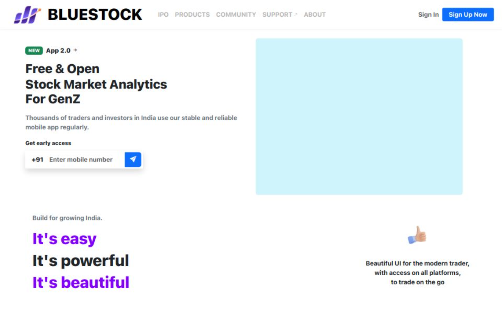

💹 Bluestock Fintech – IPO Analytics Platform

<div align="center">  </div>  <p align="center"> <strong>A modern, production-ready frontend application for Bluestock’s IPO analytics platform.</strong><br> Developed using Angular and Bootstrap, this solution provides real-time IPO insights, comprehensive tracking features, and secure document access. </p>  

## 📖 Table of Contents
- [📄 Project Overview](#-project-overview)
- [🌟 Key Features](#-key-features)
- [🛠️ Technology Stack](#️-technology-stack)
- [🚀 Live Deployment](#-live-deployment)
- [🐱 Source Code Repository](#-source-code-repository)
- [📁 Project Directory Structure](#-project-directory-structure)
- [⚙️ Getting Started](#️-getting-started)
- [🌍 Hosting Information](#-hosting-information)

## 📄 Project Overview

Bluestock is a professionally developed frontend web application designed for Bluestock Fintech to deliver actionable IPO data through an intuitive and responsive interface. The application serves as the foundation for both internal dashboards and client-facing platforms, offering structured and insightful initial public offering analytics.

## 🌟 Key Features

- 📊 **Detailed IPO Listings**
Presents essential IPO information including company logo, name, price band, issue type and size, key dates, listing gains, and current status.
- 📈 **Live Market Metrics**
Displays dynamic financial indicators such as IPO price, listing price, current market price (CMP), and automatically calculated returns.
- 📎 **Downloadable Documentation**
Provides direct access to regulatory documents like RHP and DRHP in PDF format for each IPO.
- 💻 **Responsive User Interface**
Fully optimized for seamless user experience across desktop and mobile devices.
- 🌐 **Integration-Friendly Design**
Built with embeddability in mind, enabling easy integration into third-party applications and platforms.
## 🛠️ Technology Stack

This repository contains only the frontend implementation. 

 Framework: Angular (utilizing standalone components)
Styling: Bootstrap 5
Icons & Assets: Bootstrap Icons and custom graphic assets
Backend Integration: Integrated with Bluestock's secure RESTful API
## 🚀 Live Deployment

🔗 Application URL:
🔵 View Live Application on Vercel

## 🐱 Source Code Repository

📂 GitHub Repository:
🟩 View Project on GitHub

## 📁 Project Directory Structure

```
bluestock-frontend/
├── src/
│   ├── app/
│   │   ├── components/
│   │   ├── services/
│   ├── assets/
│   │   ├── Github-Images/
│   │   │   └── Preview-Image.png
│   └── index.html
├── angular.json
├── package.json
```

## ⚙️ Getting Started

### Configuration

Copy the example environment configuration and replace placeholder values with your actual API endpoints:

```typescript
// environment.example.ts
export const environment = {
  production: false,
  apiUrl: 'http://your-api-url.com',
  googleSigninUrl: 'https://your-api-url.com/OAuth/account/google/login ',
  googleSignupUrl: 'https://your-api-url.com/OAuth/account/google/signup '
};
```

### Installation Steps

**Clone the Repository**
```bash
git clone https://github.com/monilshah1409/monilshah1409-BlueStock_Webapp_internship.git 
cd bluestock-frontend
```

**Install Dependencies**
```bash
npm install
```

**Run the Application Locally**
```bash
ng serve
The application will be accessible at: http://localhost:4200

## 🌍 Hosting Information

The frontend is deployed on Vercel .

🔗 🔵 https://blue-stock-webapp.vercel.app  